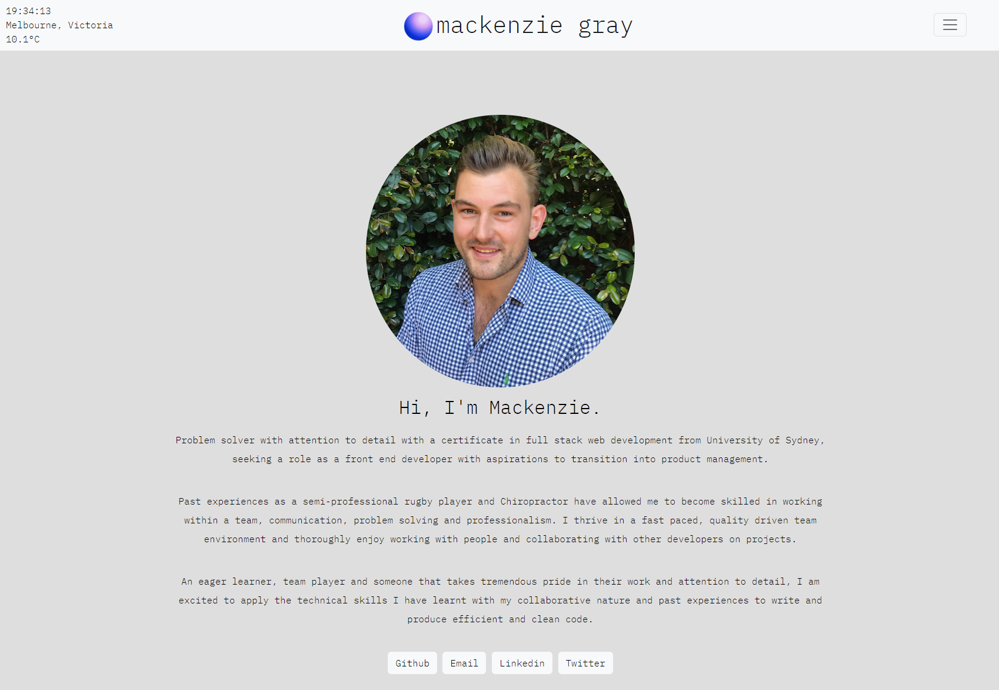
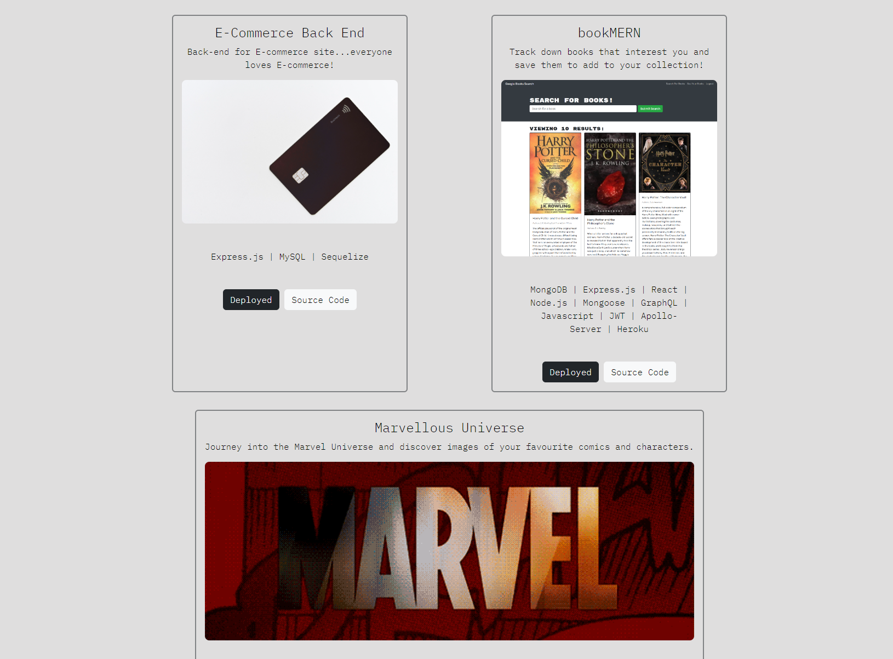
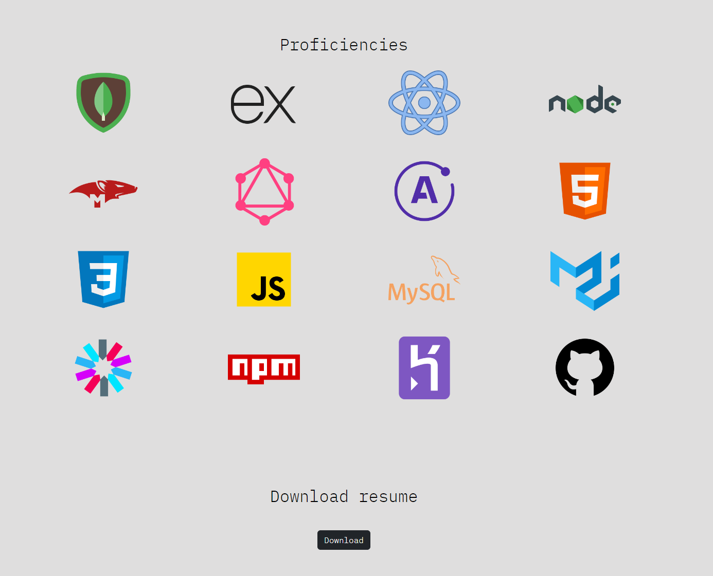

# Mackenzie Gray

## Description

A portfolio to showcase my skills and proficiencies as a full stack web developer. This was made using HTML, CSS and Javascript. 

## Screenshots

## Table of Contents

* [License](#License)
* [Acknowledgments](#Acknowledgments)
* [Questions](#Questions)

## License

Mozilla

#### For more information on the license, click the badge icon in the title section.

## Acknowledgments

University of Sydney Coding Bootcamp

## Questions

### For further information contact using the following:

#### GitHub: [mdkgray](https://github.com/mdkgray)

#### Email: mdkulen@gmail.com

_This README was generated using [README Generator](https://github.com/mdkgray/README_generator)_
